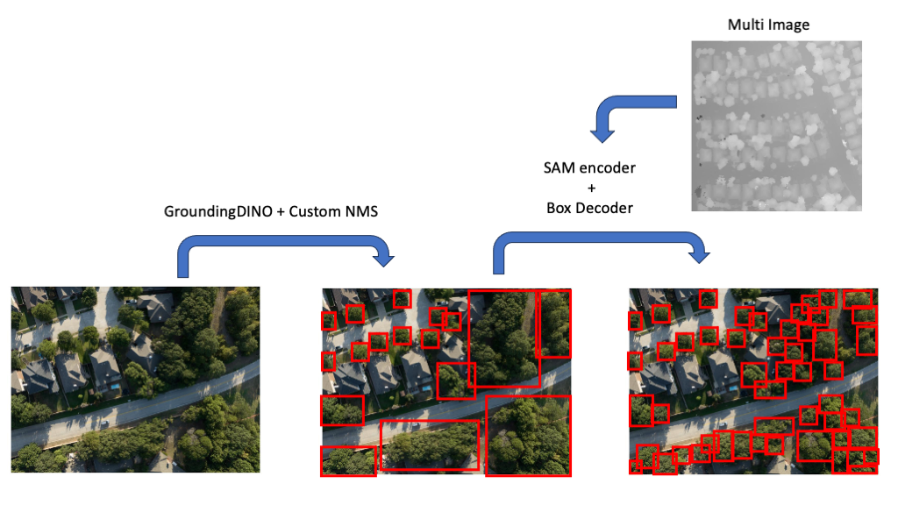

# Tree Detection and Segmentation with GroundingDINO, SAM, and the new Box Decoder

The goal of this project is to detect and ultimately segment individual tree crowns from aerial photographs and orthomosaics. The images are taken by UAV and incorporate RGB, NIR, Red-Edge, and Canopy Height or Digital Surface Models. A number of machine learning models have previously been applied to the same or similar tasks, usually based on [Faster R-CNN](https://arxiv.org/abs/1506.01497) (for detection) or [Mask R-CNN](https://arxiv.org/abs/1703.06870) (for segmentation), though occasionally incorporating other models as well, such as [DETR](https://arxiv.org/abs/2005.12872). Given that the former two models are already several years old (2015 and 2017 respectively), and newer models have shown impressive performance on open-ended detection and segmentation tasks (i.e. detecting and segmenting objects outside of a narrow range of pretrained object categories), we leverage these newer models to more accurately and more robustly detect and segment individual tree crowns.

Specifically, we use [GroundingDINO](https://arxiv.org/abs/2303.05499) to detect and put bounding boxes around individual trees, and the [Segment Anything Model (SAM)](https://arxiv.org/abs/2304.02643) to mask the specific pixels belonging to tree crowns within those boxes. This combination of GroundingDINO with SAM has already had multiple implementations, including one by the makers of GroundingDINO called [Grounded-Segment-Anything](https://github.com/IDEA-Research/Grounded-Segment-Anything), and shows excellent results on images with clearly separated trees. However it struggles in cases where multiple trees are grouped together with little or no space between their crowns. In these cases, GroundingDINO is prone to under-segmentation, i.e. putting a single bounding box around a group of trees rather than the individual trees within that group, as well as double-detection, i.e. detecting the same tree twice, often because it detects a group of trees and a few individual trees *within* the group simultaneously. To address this, we experimented with Non-Maximum Suppression (NMS), including writing functions for External Box Suppression (EBS) and a custom implementation of Non-Max Suppression that utilizes Intersection over Min Area rather than Intersection over Union (see [NMS and EBS](https://docs.google.com/presentation/d/1IE8CdFJMt3kXp-en5ic22ezSSFqznUxW/edit?usp=drive_link&ouid=106552303987763123522&rtpof=true&sd=true) and [Prompts and EBS](https://docs.google.com/presentation/d/1ZTPuxmEoRdACNqIhqQiUuiniLLlcaPw8/edit?usp=drive_link&ouid=106552303987763123522&rtpof=true&sd=true) for details and [detr/box_ops.py](segment_and_detect_anything/detr/box_ops.py) for code). However, we ultimately decided that the best approach would be to train a new Box Decoder, i.e. a model that takes as input the under-segmented bounding boxes of GroundingDINO and the pretrained image encodings of SAM and outputs fine-grained bounding boxes that more accurately detect individual trees even when there is no visible space between their crowns. These more accurate bounding boxes could then be fed back into SAM to segment the individual tree crowns with its Mask Decoder, or a new Mask Decoder could be trained in conjunction with the Box Decoder.

This repository contains code to implement and train the Box Decoder, as well as for preprocessing image data to more quickly and efficiently train the model. Below, we cover the Box Decoder's place in the overall detection and segmentation model, then the preprocessing for the image data, and finally the implementation and training details of the Box Decoder.

## Model Overview
The normal pipeline for GroundingDINO and SAM, as implemented for example in [Grounded-Segment-Anything](https://github.com/IDEA-Research/Grounded-Segment-Anything), is to first feed the image with a text prompt into GroundingDINO, which outputs bounding boxes around all instances of that object. You then feed the same image, now with bounding boxes, into SAM, which outputs a segmentation mask for each bounding box. An example of this is shown below.

In our model pipeline, the image with its text prompt is still fed into GroundingDINO to get the initial bounding boxes (we will call these "prompt bounding boxes" to distinguish them from the more fine-grained bounding boxes we will be outputting later). These prompt bounding boxes are passed through the custom Non-Max Suppression function referenced above and then fed along with the original image into the SAM encoder. An important point here is that SAM consists of multiple parts, including an **Image Encoder**, which takes an RGB image and outputs a vector representation; a **Prompt Encoder**, which takes prompts in the form of bounding boxes, point coordinates, or masks, and outputs a vector representation of these; and a **Mask Decoder**, which takes the vector representations from the image encoder and prompt encoder and outputs masks, generally one per prompt. Similar to the case above, we feed the RGB image into SAM's image encoder and the prompt bounding boxes into its prompt encoder. However, we also feed a second version of the image, called the Multi image, containing multispectral and tree height information, into SAM's Image Encoder, getting a second vector representation. We then feed both image vector representations and the prompt vector representation into our new **Box Decoder**, which in contrast to SAM's Mask Decoder will output a set number of bounding boxes per image, and these bounding boxes should more accurately capture the individual trees in the image. A mock-up example is shown below; see [Model Proposal 1](https://docs.google.com/presentation/d/1tbC6FfCw6Pp0wTwrLycnM0lAzoDz5898/edit?usp=drive_link&ouid=106552303987763123522&rtpof=true&sd=true) for a more detailed breakdown.

The Box Decoder is designed to be a lightweight module that can be swapped out with SAM's Mask Decoder without affecting any other part of the GroundingDINO or SAM pipeline. To make it work together with these components, I have had to add some functionality to other parts of SAM's pipeline, but none that affect the core functioning of GroundingDINO or SAM. As a result, we can still use GroundingDINO and SAM to detect and segment objects as before; the Box Decoder simply adds another possible output to this pipeline, outputting fine-grained bounding boxes in place of masks.

## Preprocessing
